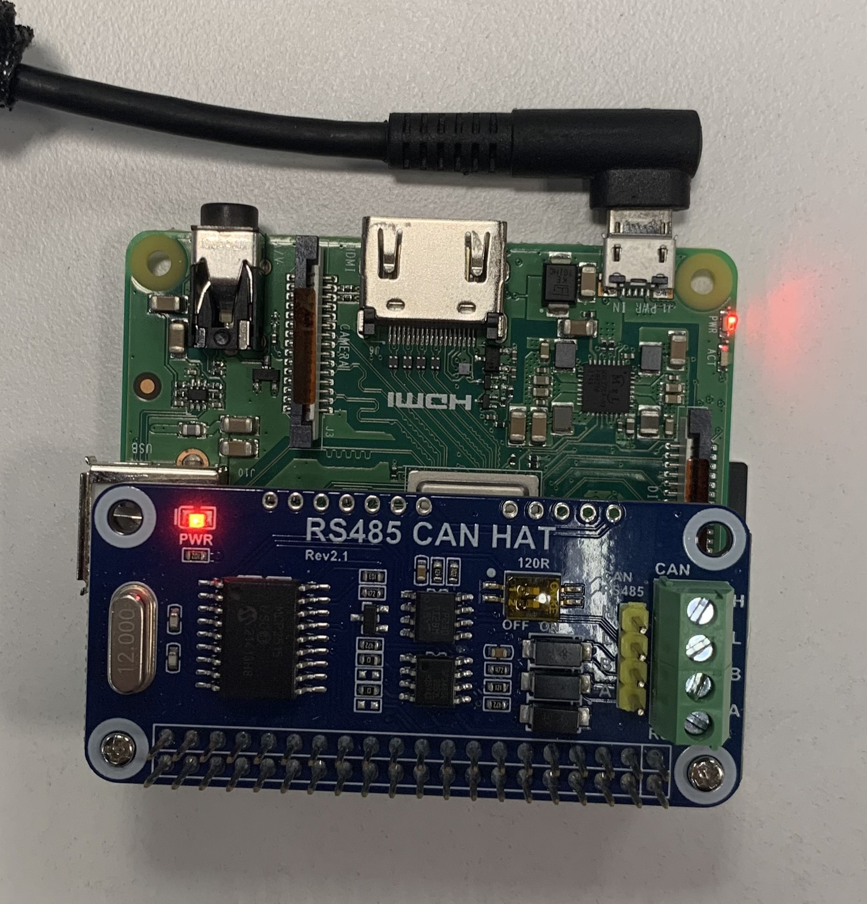
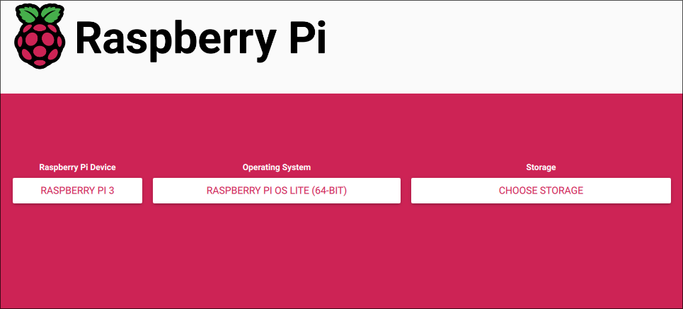
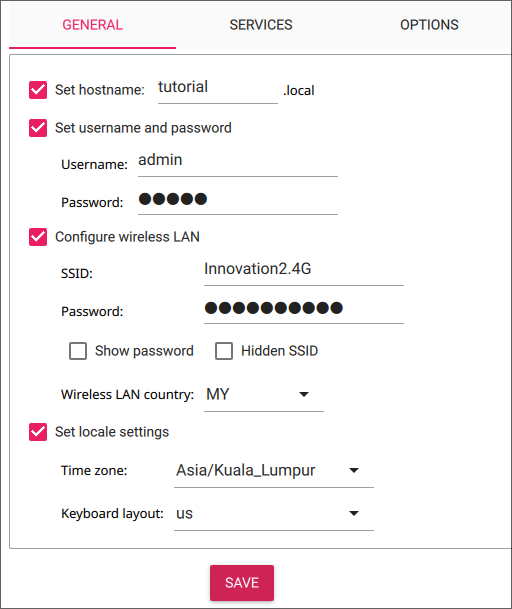

Inverter to Grafana

By directly accessing customers’ inverters, it removes the need to rely on third-party software and also provides greater insight and analysis into the solar PV system. Not only is this solution cost-effective, it is relatively easy to implement, requiring simple hardware and minimal knowledge.

# Hardware
**Raspberry Pi 3A+**

Specs

- Built in Wi-Fi with 2.4/5GHz support
- Populated 40-pi GPIO header
- 512 MB RAM
- micro-USB power port
- HDMI and USB 2.0 port
- MicroSD card slot

This is the ideal model due to its in-build features that do not require additional attachments, which may complicate the installation process. Its relatively small size allows it to be installed easily alongside the inverter.

Price: MYR 135 (Cytron)

**WaveShare RS485 Can Hat**

This allows the Pi to access the inverter via the RS485 port

Price: MYR 65 (Cytron)

**Miscellaneous**

- 5V/2.5A micro-USB power supply

   A 5V/2.5A power supply is important, as a weaker supply may cause the Pi to underperform or not turn on at all, while a stronger supply may cause heating issues that will reduce its lifespan and damage the Pi in the long run.

- TP-Link TL-WN727N Wi-Fi antenna (optional)

   If the Pi is unable to connect to the client's Wi-Fi due to location or the material of the combiner box, a Wi-Fi antenna may help with this.

- Micro-SD card
- Case

# Installation
## Manual installation
Required software:

- PuTTy (https://www.chiark.greenend.org.uk/~sgtatham/putty/latest.html)
- Raspberry Pi Imager (https://www.raspberrypi.com/software/)
- Nmap (https://nmap.org/download#windows)

Attach the can hat to the Pi’s pins as shown below.\
\
Insert the MicroSD car into your laptop and laucnh the Raspberry Pi Imager.
Select Raspberry Pi 3 for the model and Raspberry Pi OS Lite, which can be found by going to `Choose OS -> Raspberry Pi OS (Other) -> Raspberry Pi OS Lite (64-bit)` and select the microSD card's model for Storage.\
\
Select `Next -> Edit Settings` and configure the settings as shown below.\
\
**NOTE**: Change the hostname from "tutorial" to the customer's name, and ensure it is unique. Wi-Fi is the office router's SSID and password. Remeber the username and password as it will be used to login into the Pi later on.
Enable SSH with password authentication.\
\
Apply the changes and allow the program to write to the SD card. Once complete, insert the SD card into its designated slot under the Pi and boot it up with the micro-USB adapter.
Ensure your laptop is also connected to the office router, and launch Command Prompt.
To access the Pi via SSH, we need the Pi's IP address. 